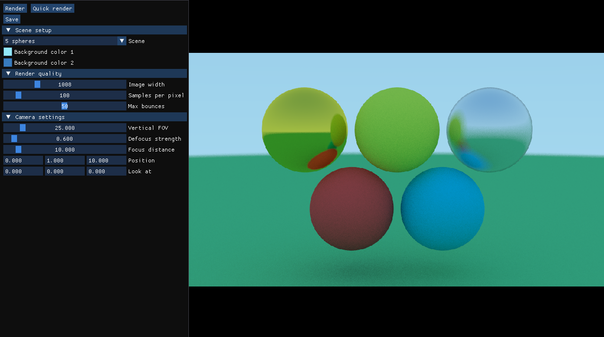

# Path Tracer
Path tracing program written in C++. Based off this [amazing tutorial](https://raytracing.github.io/).

## Features
* Lambertian, metal, dieelectric, and diffuse lighting materials
* Multi-threaded rendering
* Quad and sphere primitives
* Editor made using [SDL2](https://www.libsdl.org/) and [Dear ImGui](https://github.com/ocornut/imgui).

## Screenshots

## Build Status
