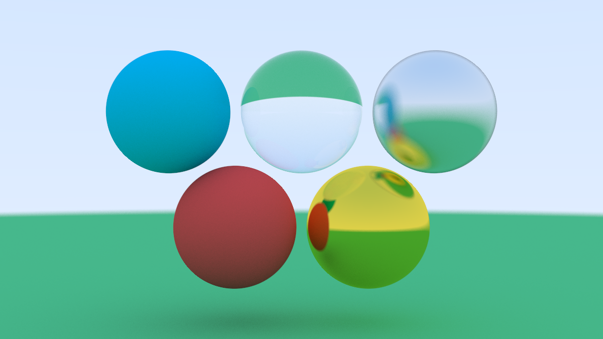
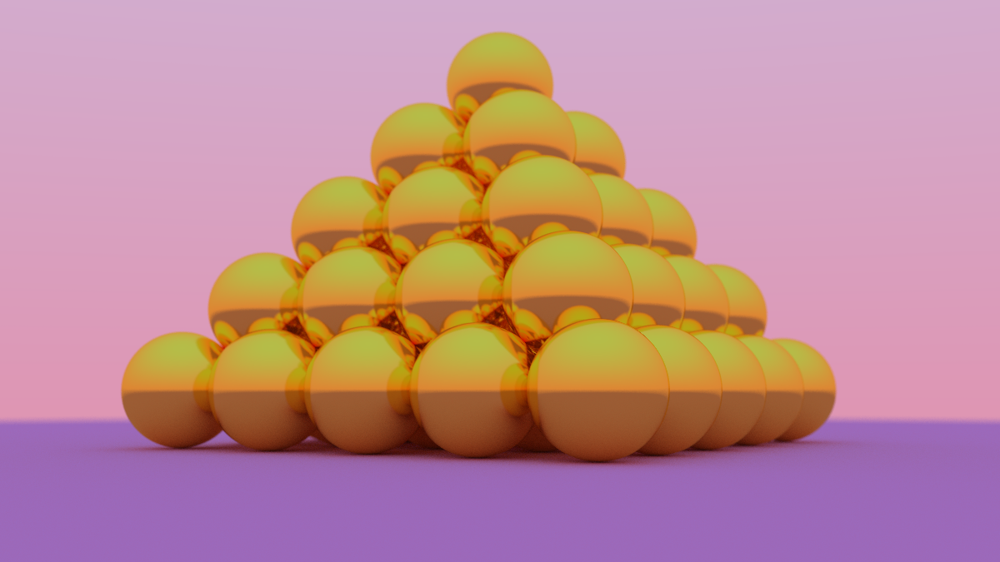

# Raytracing
WIP Raytracing program written in C++. Based off [this tutorial](https://raytracing.github.io/books/RayTracingInOneWeekend.html).

Has basic multithreading support.

Uses [SDL2](https://www.libsdl.org/) to create a display window for the output.

## Screenshots

